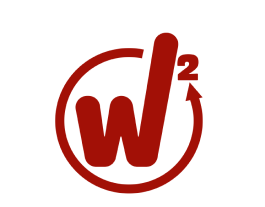

<h1 align="center">🔴 WinWin Club Application 🔴</h1>

<p align="center">
  
</p>

---

## 📜 Introduction

**WinWin** est une application mobile innovante conçue pour améliorer l'expérience des membres du WinWin Club. Elle permet de réserver des espaces, choisir des packs, commander des consommations et gérer les paiements via une interface intuitive. Développée avec **Node.js**, **Express**, et **MongoDB** pour le backend, et en **Kotlin** sur **Android Studio** pour le frontend, **WinWin** offre une solution performante et évolutive pour une communauté dynamique.

---

## 🚀 Fonctionnalités

- **Réservation d'espaces** 🏠 : Permet aux utilisateurs de réserver des espaces au sein du club.
- **Choix de packs** 🎁 : Sélection de packs en fonction des besoins de l'utilisateur.
- **Commande de consommations** 🍹 : Commande directe de consommations via l'application.
- **Gestion des paiements** 💳 : Intégration d'un système de paiement sécurisé.

---

## 🛠️ Technologies Utilisées

- **Backend** : Node.js, Express, MongoDB
- **Frontend** : Android Studio, Kotlin

---

## 🔧 Installation

1. Clonez le dépôt :
   ```bash
   git clone https://github.com/seifriahi/WinwinClub.git
